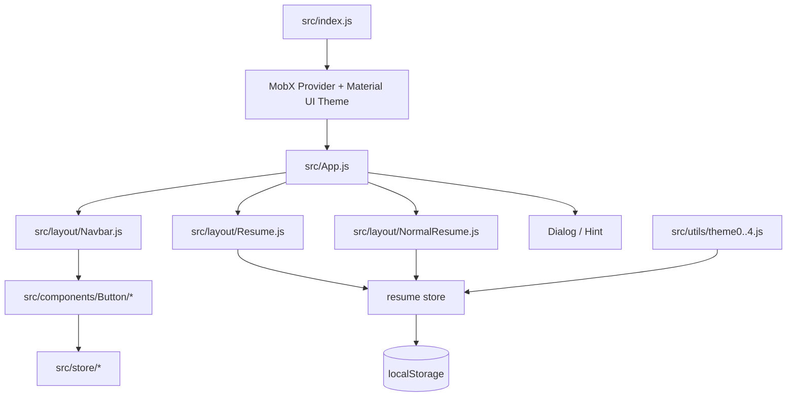

# Markdown Resume 开发与维护指南

最后核对日期：2026-09-12

## 1. 项目概况

这是一个纯前端、浏览器本地优先的单页简历排版工具。用户通过网格编辑 Markdown 或富文本内容，数据保存在浏览器 `localStorage`，可以导入/导出 JSON，并通过浏览器打印生成 PDF。

- 源码仓库：`git@github.com:karle33/markdown-resume.git`
- 默认分支：`master`
- 线上地址：<https://karle33.github.io/markdown-resume/>
- 托管方式：GitHub Pages + GitHub Actions
- 后端服务：无
- 主要目标浏览器：桌面版 Chrome

当前技术栈较旧：React 16.8、MobX 5、mobx-react 5、Material-UI 3、react-grid-layout 0.16、Markdown-It 8、Webpack 4 和 Jest 23。构建配置是早期 Create React App 弹出（eject）后的本地配置，而不是现代 `react-scripts` 项目。

## 2. 总体架构



### 目录职责

| 路径 | 职责 |
| --- | --- |
| `src/index.js` | 创建主题和 MobX Provider，挂载应用 |
| `src/App.js` | 页面骨架、模式选择、打印状态、全局点击提交 |
| `src/layout/` | 导航栏、Markdown 简历、普通简历、弹窗与提示布局 |
| `src/components/Button/` | 格式、布局、图片、导入导出等工具栏操作 |
| `src/components/Navbar/` | 将工具按钮组合成导航栏分组 |
| `src/components/Dialog/` | 模板、链接、帮助弹窗 |
| `src/store/` | MobX 单例 store |
| `src/utils/helper.js` | Markdown 解析、布局计算、导入校验和文件下载 |
| `src/utils/themeFormat.js` | 主题色标记的添加/移除纯函数 |
| `src/utils/theme0.js` ～ `theme4.js` | 内置简历模板数据 |
| `config/`、`scripts/` | eject 后的 Webpack、Jest 和开发服务器配置 |
| `public/` | HTML 模板、manifest 和基础样式 |
| `.github/workflows/pages.yml` | GitHub Pages 自动构建和发布 |

## 3. 状态与数据模型

### MobX stores

- `resume`：布局、当前选中网格、拖拽/缩放状态、新增项计数，以及所有布局持久化操作。
- `navbar`：按钮可用状态、主题色、打印状态、编辑模式和模板编号。
- `dialog`：帮助、链接、模板切换弹窗状态。
- `hint`：右下角成功/错误 Snackbar。

这些 store 都是模块级单例，通过 `src/index.js` 中的 `Provider` 注入组件。

### localStorage 键

| 键 | 内容 |
| --- | --- |
| `layout` | 完整布局 JSON |
| `templateNum` | 当前模板编号 |
| `markdownMode` | `"true"` 或 `"false"` |

项目没有云端同步。清理浏览器站点数据会删除简历；图片采用 Data URL 后也存储在 `layout` 中。

### 布局项结构

典型布局项如下：

```json
{
  "i": "item_0",
  "x": 0,
  "y": 0,
  "w": 6,
  "h": 2,
  "moved": false,
  "static": false,
  "value": "Markdown 内容",
  "origin": "<section><p>普通模式 HTML</p></section>"
}
```

重要约束：

- `i` 必须是唯一的 `item_<数字>`。
- `x/y/w/h` 由 `react-grid-layout` 使用；宽高必须为正数。
- `value` 仅供 Markdown 模式使用。
- `origin` 仅供普通模式使用。
- 两种模式默认互相独立。用户在一种模式中的文字修改不会自动同步到另一种模式。
- 图片是例外：`resume.setPicture` 会同时更新两种表示，保证切换模式后仍能看到图片。

## 4. 编辑与格式化机制

简历网格不是受控输入组件，而是 `contentEditable` DOM：

1. 单击网格后，`Resume`/`NormalResume` 设置 `resume.choosenKey`。
2. Markdown 模式把 `data-markdown` 放回可编辑文本；普通模式直接编辑 HTML DOM。
3. 格式按钮读取浏览器选区，修改 DOM 和 `data-markdown` 或 `data-origin`。
4. 按 Enter、切换网格或触发 `App` 的全局点击逻辑时，store 将 DOM 内容写回布局和 `localStorage`。

这套流程对事件冒泡和 DOM 层级比较敏感。修改按钮行为时应同时验证：选区是否保留、属性是否更新、点击其他位置后是否持久化、重新加载后是否仍然正确。

### Markdown 扩展语法

| 功能 | 表示形式 |
| --- | --- |
| 一级标题 | `# 文本` |
| 二级标题 | `## 文本` |
| 加粗 | `**文本**` |
| 主题色 | 反引号包裹的行内代码 |
| 列表 | `- 文本` |
| 横线 | `---` |
| 竖线 | `+++` |
| 水平对齐 | `[-S]`、`[-C]`、`[-E]` |
| 垂直对齐 | `[+S]`、`[+C]`、`[+E]` |

主题色实现是一个历史设计：Markdown 的反引号被解析为 `<code>`，普通模式直接写入 `<code>`，随后 `Resume` 和 `NormalResume` 将 `code` 的文字颜色设为主题色。`Bucket` 现在是切换操作：普通文字会加标记，完整选中的已着色文字会去除标记。

主题色和线条颜色通过 `document.styleSheets[0].rules[index]` 修改，依赖 `public/index.html` 中 CSS 规则的固定顺序。调整该文件的内联 CSS 时必须同步检查两个 Resume 组件，否则可能改变错误的规则。

## 5. 图片、导入与导出

### 图片

图片完全在浏览器端处理，不再上传到第三方图床：

- 支持 JPEG、PNG、GIF、WebP。
- 单张图片最大 2 MB，常量位于 `src/utils/constant.js`。
- `FileReader.readAsDataURL` 生成 Data URL。
- `resume.setPicture` 同时写入 `value`、`origin` 和 `localStorage`。
- 浏览器存储配额不足时会显示错误，不应回退到静默失败。

Data URL 会显著增大导出的 JSON。若将来需要多图或大图，应优先增加客户端压缩，或设计带鉴权的后端存储；不要把第三方 API Token 写进静态前端。

### 导入

`Export` 使用 `FileReader` 读取 JSON，然后调用 `parseImportedLayout` 做结构校验，最后通过 `resume.switchLayout` 原地切换。导入不应修改 `window.location.href`，否则 GitHub Pages 项目路径会丢失。

当前校验保证 JSON、数组结构、网格坐标、键唯一性和两种内容字段有效，但不会清理 `origin` HTML。应用通过 `dangerouslySetInnerHTML` 显示该字段，因此只应导入可信文件。若要接受第三方模板，必须先增加 HTML 白名单清理。

### 导出

- “保存到本地”下载 `layout` 的 JSON 备份。
- “导出 PDF”切换打印状态并调用 `window.print()`；实际 PDF 由浏览器打印面板生成。

## 6. 本地开发

### 安装依赖

```bash
corepack enable
yarn install --frozen-lockfile
```

项目在 `package.json` 中固定 Yarn 1.22.22。若环境没有 Corepack，可自行安装 Yarn 1，但不要改用 npm 生成第二份锁文件。

### 测试

在现代 Node 上建议使用：

```bash
CI=true NODE_OPTIONS=--openssl-legacy-provider yarn test --runInBand
```

截至本文更新时间，共有 4 个测试套件、8 个测试。它们覆盖应用挂载、导入布局校验、图片双模式持久化和主题色切换。

### 生产构建与本地预览

```bash
PUBLIC_URL=/ NODE_OPTIONS=--openssl-legacy-provider yarn build
python3 -m http.server 8080 --directory build
```

打开 <http://localhost:8080>。`PUBLIC_URL=/` 只用于这次本地预览，使资源从本机根路径加载；GitHub Actions 构建时不设置它，会继续按照 `homepage` 生成 `/markdown-resume/` 资源路径。

### 开发服务器兼容性

当前机器验证结果：

- Node 24：测试和生产构建可用，但需要 `--openssl-legacy-provider`。
- Node 24：`yarn start` 失败，错误为 `No such module: http_parser`，来源是旧版 `webpack-dev-server` 的 `spdy/http-deceiver` 依赖。

如需热更新开发服务器，可使用兼容旧工具链的 Node 版本（Node 16 是候选，但本仓库未在 CI 中验证），或优先迁移到 Vite。不要通过修改业务代码绕过该依赖错误。

## 7. GitHub Pages 部署

`package.json` 的 `homepage` 是：

```text
https://karle33.github.io/markdown-resume
```

推送到 `master` 后，`.github/workflows/pages.yml` 会：

1. 使用 Node 20 和 Yarn 1.22.22 安装锁定依赖。
2. 带 `NODE_OPTIONS=--openssl-legacy-provider` 构建。
3. 上传 `build/` Pages artifact。
4. 发布到 `github-pages` environment。

仓库 Settings → Pages 的 Source 必须保持为 **GitHub Actions**。

发布后至少检查：

```bash
curl -I https://karle33.github.io/markdown-resume/
```

并在浏览器验证主脚本、CSS、图片、导入、打印功能。静态资源 URL 必须以 `/markdown-resume/` 开头。

不要运行根目录 `deploy.sh`：该脚本会初始化 `build` 为独立仓库，并强制推送到原作者的 `mdresume/mdresume.github.io`。

## 8. 已知风险与技术债

1. 构建链和主要依赖停留在 2019 年左右，现代 Node 兼容性有限。
2. Webpack 4 使用 MD4，现代 OpenSSL 需要 legacy provider。
3. 开发服务器依赖已移除的 Node 内部 `http_parser`。
4. 组件大量使用 legacy decorators；升级 Babel/MobX 时必须整体迁移。
5. 格式化依赖直接 DOM 操作、浏览器 Selection API 和事件冒泡，容易出现状态与 DOM 不一致。
6. 主题样式通过 CSSOM 数字索引修改，CSS 规则顺序不可随意调整。
7. 普通模式的 HTML 未消毒；导入不可信 JSON 存在内容注入风险。
8. `document.execCommand` 已废弃，粘贴逻辑未来需要替代。
9. 图片 Data URL 和完整布局共用 `localStorage`，受到浏览器配额限制。
10. `axios` 已不再被图片功能使用，但仍保留在直接依赖中，可在后续依赖清理时移除。
11. README 中的在线 demo 仍指向上游站点，和当前 Pages 地址不一致。

## 9. 建议的维护顺序

### 日常修改

1. 确认工作区状态，避免覆盖无关改动。
2. 找到对应 Button、layout 和 store 的完整数据流。
3. 优先把字符串/格式转换写成 `src/utils/` 中的纯函数并补单元测试。
4. 同时检查 Markdown 和普通两种模式。
5. 运行全量测试和生产构建。
6. 推送后检查 Pages workflow 和线上资源。

### 现代化优先级

建议采用分阶段迁移：

1. 用 Vite 替换 eject 的 Webpack 4 构建链，暂时保留 React 16、MobX 5 和 Material-UI 3。
2. 将装饰器逐步改为显式 HOC/现代 MobX 写法。
3. 再升级 React、MobX 和 Material UI，避免一次改动过多。
4. 将 `contentEditable` 编辑与格式化收敛为受控数据模型。
5. 增加浏览器端交互测试，重点覆盖选区、格式切换、导入、图片和打印。

## 10. 变更验收清单

- [ ] Markdown 模式正常编辑、格式化和保存。
- [ ] 普通模式正常编辑、格式化和保存。
- [ ] 刷新后布局与内容未丢失。
- [ ] JSON 导出后可以重新导入。
- [ ] 非法 JSON 不覆盖当前内容。
- [ ] 图片在两种模式可见，刷新和导入后仍可见。
- [ ] 油漆桶可添加和取消主题色。
- [ ] 网格拖拽、缩放、新增和删除正常。
- [ ] PDF 打印时工具栏和边框隐藏。
- [ ] `yarn test --runInBand` 通过。
- [ ] `yarn build` 通过且资源路径为 `/markdown-resume/`。
- [ ] GitHub Pages workflow 成功，线上首页和主资源返回 200。
